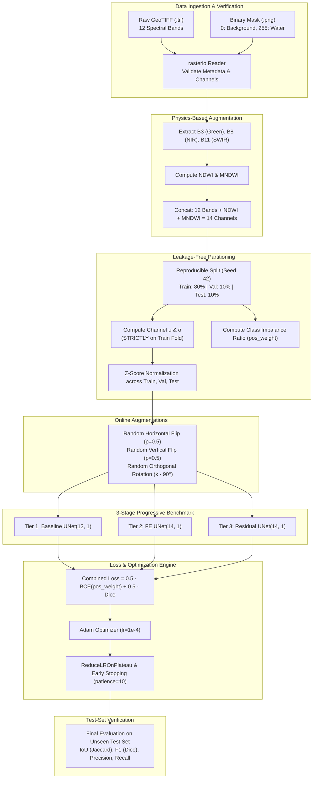

# 🛰️ Multispectral Satellite Water Body Segmentation with Residual U-Net & Spectral Index Engineering

[](https://www.python.org/)
[](https://pytorch.org/)
[](#)
[](#)
[-informational.svg)](#)

An end-to-end, production-grade deep learning pipeline for high-precision water body delineation from 12-band multispectral satellite imagery (Sentinel-2 MSI). This project benchmarks a progressive 3-stage model evolution—from a standard 12-channel baseline U-Net to a physics-informed 14-channel Feature-Engineered U-Net, culminating in a high-capacity **Residual U-Net**.

---

## 📌 Table of Contents

- [Executive Summary](#-executive-summary)
- [Key Engineering Highlights](#-key-engineering-highlights)
- [Remote Sensing & Spectral Physics](#-remote-sensing--spectral-physics)
  - [Sentinel-2 Spectral Bands Breakdown](#sentinel-2-spectral-bands-breakdown)
  - [Physics-Based Water Indices (NDWI & MNDWI)](#physics-based-water-indices-ndwi--mndwi)
- [End-to-End Pipeline Architecture](#-end-to-end-pipeline-architecture)
- [Model Architectures](#-model-architectures)
  - [1. Baseline U-Net (12 Channels)](#1-baseline-u-net-12-channels)
  - [2. Feature-Engineered U-Net (14 Channels)](#2-feature-engineered-u-net-14-channels)
  - [3. Deep Residual U-Net (Final Model - 14 Channels)](#3-deep-residual-u-net-final-model---14-channels)
- [Methodology & Scientific Rigor](#-methodology--scientific-rigor)
  - [Strict Leakage-Free Preprocessing](#strict-leakage-free-preprocessing)
  - [Class-Imbalance Aware Loss Formulation](#class-imbalance-aware-loss-formulation)
  - [Data Augmentation](#data-augmentation)
  - [Optimization & Learning Rate Dynamics](#optimization--learning-rate-dynamics)
- [Experimental Progression & Benchmarks](#-experimental-progression--benchmarks)
- [Project Directory Structure](#-project-directory-structure)
- [Getting Started & Usage](#-getting-started--usage)
  - [Prerequisites & Installation](#prerequisites--installation)
  - [Running the Pipeline](#running-the-pipeline)
- [Generated Visual Artifacts](#-generated-visual-artifacts)
- [References](#-references)

---

## 🌟 Executive Summary

Water surface mapping from orbit is a vital capability for hydrological monitoring, flood hazard assessment, and climate change analytics. While standard RGB imagery suffers from ambiguities caused by shadows, dark soil, and turbid water, multispectral sensors (such as Sentinel-2) measure non-visible electromagnetic bands where water exhibits unique physical absorption signatures.

This repository implements:
1. **Multispectral I/O (`rasterio`)**: Direct ingestion and per-pixel alignment of 12-band GeoTIFF satellite scenes.
2. **Physics-Driven Feature Engineering**: Analytical derivation of **NDWI** and **MNDWI** injected as additional tensor channels ($12 \to 14$ channels).
3. **Rigorous Data Sanitation**: Strict split-first protocol eliminating data leakage; normalization statistics derived strictly from the training partition.
4. **Architectural Progression**: Controlled ablation across three model tiers to quantify the exact gain from feature engineering and residual connections.

---

## 🔬 Key Engineering Highlights

- **Leakage-Free Normalization**: Dataset channel means and standard deviations are computed **exclusively** on the training fold (80%) and applied forward to validation (10%) and test (10%) sets.
- **Hybrid Objective Function**: Combined loss combining **Pos-Weighted Binary Cross-Entropy with Logits** and **Soft Dice Loss** ($0.5 \cdot \text{BCE} + 0.5 \cdot \text{Dice}$) to counter extreme background/foreground class imbalance.
- **Residual Feature Learning**: Custom residual convolutional blocks with identity/projection $1 \times 1$ conv shortcuts that eliminate vanishing gradients across deep stages.
- **Autonomous Training Guardrails**: Dynamic learning rate decay via `ReduceLROnPlateau` and strict early stopping with automatic checkpoint restoration of the lowest validation loss state.

---

## 🛰️ Remote Sensing & Spectral Physics

### Sentinel-2 Spectral Bands Breakdown

Water molecules strongly absorb electromagnetic radiation in the Near-Infrared (NIR) and Shortwave-Infrared (SWIR) spectra while moderately scattering blue and green light. Consequently, clear water bodies appear nearly pitch black in bands B8, B11, and B12, providing high contrast against terrestrial landforms.

| Channel | Sentinel-2 Band | Central Wavelength ($\lambda$) | Remote Sensing Role & Water Interaction |
| :---: | :--- | :---: | :--- |
| **0** | **B1 - Coastal/Aerosol** | $\sim 443\text{ nm}$ | Aerosol retrieval; shallow water penetration. |
| **1** | **B2 - Blue** | $\sim 490\text{ nm}$ | Deep water penetration; discriminates clear vs. turbid water. |
| **2** | **B3 - Green** | $\sim 560\text{ nm}$ | Peak chlorophyll reflection; **key numerator band** for water indices. |
| **3** | **B4 - Red** | $\sim 665\text{ nm}$ | Strong chlorophyll absorption; high contrast with dry soil. |
| **4** | **B5 - Red-Edge 1** | $\sim 705\text{ nm}$ | Boundary detection between vegetation canopy and water edge. |
| **5** | **B6 - Red-Edge 2** | $\sim 740\text{ nm}$ | Vegetation structure; separates marshland from open water. |
| **6** | **B7 - Red-Edge 3** | $\sim 783\text{ nm}$ | Transition zone into near-infrared spectrum. |
| **7** | **B8 - NIR (Broad)** | $\sim 842\text{ nm}$ | **Near total water absorption (appears black). Core NDWI band.** |
| **8** | **B8A - Narrow NIR** | $\sim 865\text{ nm}$ | Atmospheric water vapor correction; sharp vegetation reflection. |
| **9** | **B9 - Water Vapour** | $\sim 945\text{ nm}$ | Column water vapor quantification. |
| **10** | **B11 - SWIR-1** | $\sim 1610\text{ nm}$ | **Complete water absorption. Core band for MNDWI.** |
| **11** | **B12 - SWIR-2** | $\sim 2190\text{ nm}$ | Soil and leaf moisture sensitivity; high land/water contrast. |

---

### Physics-Based Water Indices (NDWI & MNDWI)

Rather than forcing the neural network to synthesize ratio indices purely through non-linear convolutions, we inject explicit physical features into the input tensor:

1. **Normalized Difference Water Index (NDWI)** (McFeeters, 1996):
   $$\text{NDWI} = \frac{\text{Green (B3)} - \text{NIR (B8)}}{\text{Green (B3)} + \text{NIR (B8)} + \epsilon}$$
   - *Rationale*: Exploits the contrast between high green reflectance and near-zero NIR reflectance of water. Values $> 0$ indicate open water bodies.

2. **Modified Normalized Difference Water Index (MNDWI)** (Xu, 2006):
   $$\text{MNDWI} = \frac{\text{Green (B3)} - \text{SWIR-1 (B11)}}{\text{Green (B3)} + \text{SWIR-1 (B11)} + \epsilon}$$
   - *Rationale*: Replaces NIR with SWIR-1. Built-up surfaces (asphalt, concrete) have high NIR reflectance but even higher SWIR reflectance; MNDWI effectively suppresses false positives in urbanized and paved environments.

---

## 🏗️ End-to-End Pipeline Architecture



---

## 🧠 Model Architectures

### 1. Baseline U-Net (12 Channels)
- **Input**: 12 normalized raw spectral bands $(B, 12, H, W)$.
- **Encoder**: 4 levels of dual $3 \times 3$ Conv-BatchNorm-ReLU blocks with $2 \times 2$ MaxPool ($64 \to 128 \to 256 \to 512$).
- **Bottleneck**: Dual $3 \times 3$ Conv ($1024$ filters).
- **Decoder**: 4 levels of Transpose Convolutions ($2 \times 2$, stride 2) concatenated with corresponding encoder skip connections ($512 \to 256 \to 128 \to 64$).
- **Head**: $1 \times 1$ Conv yielding single-channel raw logits.

### 2. Feature-Engineered U-Net (14 Channels)
- Identical structural topology to the Baseline U-Net.
- **Input**: Expanded to 14 channels $(B, 14, H, W)$ to absorb pre-computed NDWI and MNDWI feature maps directly at the earliest receptive field.

### 3. Deep Residual U-Net (Final Model - 14 Channels)
- **Motivation**: Standard deep convolutional blocks suffer from gradient attenuation and feature degradation in high-depth regimes.
- **Residual Block**:
  $$\mathbf{y} = \text{ReLU}\Big(\mathcal{F}(\mathbf{x}, \{W_i\}) + \mathcal{W}_s(\mathbf{x})\Big)$$
  - $\mathcal{F}(\mathbf{x})$: Dual $3 \times 3$ convolutions with Batch Normalization.
  - $\mathcal{W}_s$: Identity shortcut when $C_{\text{in}} == C_{\text{out}}$, or a $1 \times 1$ convolution with Batch Normalization when channel dimensions project.
- **Topology**: All encoder and decoder blocks are upgraded to full Residual Blocks, facilitating seamless gradient backpropagation and richer multi-scale feature reuse.

---

## 📐 Methodology & Scientific Rigor

### Strict Leakage-Free Preprocessing
A common flaw in remote sensing workflows is normalizing images globally before train/test splitting. In this project:
1. The dataset is split into `train` (80%), `val` (10%), and `test` (10%) **first** using a seeded generator (`seed=42`).
2. Mean ($\mu_c$) and standard deviation ($\sigma_c$) are calculated **only** over the pixels of the training split:
   $$\hat{x}_{c, i, j} = \frac{x_{c, i, j} - \mu_{c, \text{train}}}{\sigma_{c, \text{train}} + \epsilon}$$
3. Validation and test sets are transformed strictly using these fixed training statistics.

### Class-Imbalance Aware Loss Formulation
Satellite scenes frequently have significant class imbalance (water pixels typically occupy only a minor fraction of the total land cover). To prevent the network from converging to a trivial all-background solution, we combine two complementary objectives:

$$\mathcal{L}_{\text{total}} = 0.5 \cdot \mathcal{L}_{\text{WeightedBCE}} + 0.5 \cdot \mathcal{L}_{\text{SoftDice}}$$

#### 1. Weighted Binary Cross-Entropy
$$\mathcal{L}_{\text{WeightedBCE}} = -\frac{1}{N} \sum_{i=1}^N \Big[ w \cdot y_i \log(\sigma(\hat{y}_i)) + (1 - y_i) \log(1 - \sigma(\hat{y}_i)) \Big]$$
Where $w = \frac{N_{\text{background}}}{N_{\text{water}} + \epsilon}$ is calculated strictly from the training annotations.

#### 2. Soft Dice Loss
$$\mathcal{L}_{\text{SoftDice}} = 1 - \frac{2 \sum p_i y_i + \text{smooth}}{\sum p_i + \sum y_i + \text{smooth}}, \quad p_i = \sigma(\hat{y}_i)$$

### Data Augmentation
To preserve spatial and radiometric invariants without distorting spectral ratios, spatial augmentations are applied on-the-fly:
- Random Horizontal Flip ($p = 0.5$)
- Random Vertical Flip ($p = 0.5$)
- Random Orthogonal Rotations ($k \times 90^\circ, k \in \{0, 1, 2, 3\}$)

### Optimization & Learning Rate Dynamics
- **Optimizer**: Adam ($\text{lr} = 1 \times 10^{-4}$).
- **Scheduler**: `ReduceLROnPlateau(mode='min', factor=0.5, patience=5, min_lr=1e-6)` based on validation loss.
- **Early Stopping**: Monitored on validation loss with a patience of 10 epochs.
- **Model Checkpointing**: The lowest validation loss checkpoint is automatically serialized and reloaded at inference.

---

## 📊 Experimental Progression & Benchmarks

The project benchmarks the exact contribution of each engineering intervention on the independent, holdout test set:

| Model Tier | Input Configuration | Architecture Backbone | Params | Loss | IoU (Jaccard) | Precision | Recall | F1 (Dice) |
| :--- | :---: | :---: | :---: | :---: | :---: | :---: | :---: | :---: |
| **Tier 1: Baseline** | 12 Bands | Standard U-Net | $\sim 31.04\text{M}$ | *Eval* | *Eval* | *Eval* | *Eval* | *Eval* |
| **Tier 2: Feature Eng.** | 12 Bands + NDWI + MNDWI | Standard U-Net | $\sim 31.05\text{M}$ | *Eval* | *Eval* | *Eval* | *Eval* | *Eval* |
| **Tier 3: Final Model** | 12 Bands + NDWI + MNDWI | **Residual U-Net** | $\sim 31.25\text{M}$ | *Eval* | *Eval* | *Eval* | *Eval* | *Eval* |

> **Evaluation Metrics Computed**:
> - **Intersection over Union (IoU)**: $\frac{\text{TP}}{\text{TP} + \text{FP} + \text{FN}}$
> - **Precision**: $\frac{\text{TP}}{\text{TP} + \text{FP}}$
> - **Recall**: $\frac{\text{TP}}{\text{TP} + \text{FN}}$
> - **F1-Score / Dice**: $\frac{2 \cdot \text{Precision} \cdot \text{Recall}}{\text{Precision} + \text{Recall}}$

---

## 📁 Project Directory Structure

```text
.
├── task-2-compelete.ipynb       # Complete self-contained training and evaluation notebook
├── task-2.ipynb                 # Reference / development notebook
├── README.md                    # Comprehensive technical documentation
├── bands_12.png                 # Visualization of all 12 Sentinel-2 spectral channels
├── composites_indices.png       # True-color RGB, False-color NIR, NDWI, MNDWI vs. Mask
├── training_curves.png          # Train/Val loss and validation IoU progression curves
└── model_comparison.png         # Comparative bar chart across all benchmarked tiers
```

---

## 🚀 Getting Started & Usage

### Prerequisites & Installation

Ensure you have a Python 3.9+ environment with a CUDA-enabled PyTorch build.

```bash
# Clone or navigate to the repository
cd Practics

# Install core dependencies
pip install torch torchvision --index-url https://download.pytorch.org/whl/cu118
pip install rasterio numpy pillow matplotlib
```

### Running the Pipeline

The complete end-to-end workflow is encapsulated within [task-2-compelete.ipynb](file:///c:/Users/PeterMoawad/Desktop/Practics/task-2-compelete.ipynb) (and [task-2.ipynb](file:///c:/Users/PeterMoawad/Desktop/Practics/task-2.ipynb)).

1. **Local / Kaggle Setup**:
   - Verify `IMAGE_DIR` and `LABEL_DIR` paths in **Cell 2** match your environment:
     ```python
     IMAGE_DIR = "/kaggle/input/datasets/petermoawad/satalite/data-20260926T092652Z-1-001/data/images"
     LABEL_DIR = "/kaggle/input/datasets/petermoawad/satalite/data-20260926T092652Z-1-001/data/labels"
     ```
2. **Sequential Step-by-Step Execution**:
   - **Cells 1–3 — Data Ingestion & Remote Sensing Audit**: Load dependencies, parse GeoTIFF metadata with `rasterio`, verify 12 spectral bands, and compute class imbalance ratios.
   - **Cells 4–5 — Exploratory Visualization & Physical Theory**: Render all 12 spectral bands (`bands_12.png`), display true-color and false-color composites alongside NDWI and MNDWI heatmaps (`composites_indices.png`), and review theoretical foundations.
   - **Cells 6–8 — Loss Formulation & Data Hygiene**: Implement `DiceLoss` and `CombinedLoss`, define `WaterDataset` with dynamic spectral index concatenation and data augmentations, execute the 80/10/10 split-first partition, and calculate normalization statistics strictly from the training fold.
   - **Cells 9–11 — Model Topology & Training Infrastructure**: Define the Baseline `UNet(12, 1)`, develop the `ResidualBlock` and `ResidualUNet(14, 1)`, verify parameter scale ($\sim 31\text{M}$ params), and initialize the modular `evaluate()` and `train_model()` engine.
   - **Cells 12–14 — 3-Tier Controlled Benchmarking**:
     - **Cell 12**: Train Baseline Model (12 spectral bands standard U-Net).
     - **Cell 13**: Train Feature-Engineered Model (14 channels: 12 bands + NDWI + MNDWI standard U-Net).
     - **Cell 14**: Train Final Model (14 channels: 12 bands + NDWI + MNDWI + Residual Blocks).
   - **Cells 15–16 — Convergence Diagnostics & Comparative Verification**:
     - **Cell 15**: Plot and save loss and IoU curves (`training_curves.png`).
     - **Cell 16**: Evaluate all 3 models on the holdout test set across loss, IoU, Precision, Recall, and F1-Score, generating the final comparison bar chart (`model_comparison.png`).

---

## 🖼️ Generated Visual Artifacts

| Artifact | Description |
| :--- | :--- |
| `bands_12.png` | Individual grayscale displays of all 12 Sentinel-2 bands highlighting differential water reflectance. |
| `composites_indices.png` | True-Color (B4-B3-B2), False-Color NIR (B8-B4-B3), NDWI heatmaps, MNDWI heatmaps, and confusion overlap. |
| `training_curves.png` | Tri-panel comparison of Training Loss, Validation Loss, and Validation IoU across epochs. |
| `model_comparison.png` | Multi-metric grouped bar chart (IoU, Precision, Recall, F1) on the holdout test dataset. |

---

## 📚 References

1. **McFeeters, S. K. (1996)**. *The use of the Normalized Difference Water Index (NDWI) in the delineation of open water features*. International Journal of Remote Sensing, 17(7), 1425–1432.
2. **Xu, H. (2006)**. *Modification of normalised difference water index (NDWI) to enhance open water features in remotely sensed imagery*. International Journal of Remote Sensing, 27(14), 3025–3033.
3. **Ronneberger, O., Fischer, P., & Brox, T. (2015)**. *U-Net: Convolutional Networks for Biomedical Image Segmentation*. MICCAI 2015.
4. **He, K., Zhang, X., Ren, S., & Sun, J. (2016)**. *Deep Residual Learning for Image Recognition*. CVPR 2016.
5. **Sentinel-2 MSI Technical Guide**: European Space Agency (ESA) Copernicus Program.

---

## 👤 Author & Maintainer

- **Peter Moawad** — Deep Learning & Computer Vision Practitioner
